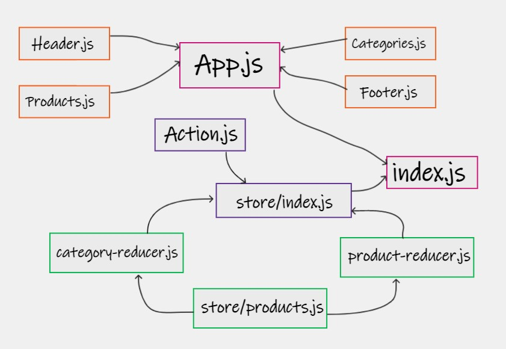

# storefront

An application that will power an online storefront that will allow our users to browse our product offerings by category, place items in their shopping cart, and check-out when they are ready to make their purchase

### Phase 1 Requirements

- As a user, I expect to see a list of available product categories in the store so that I can easily browse products
- As a user, I want to choose a category and see a list of all available products matching that category
- As a user, I want a clean, easy to use user interface so that I can shop the online store with confidence
- UML :

- [PR redux](https://github.com/ManalKhAlbahar/storefront/pull/3)
- [PR combined-reducers](https://github.com/ManalKhAlbahar/storefront/pull/2)

